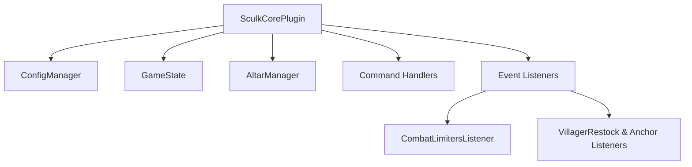

# SculkCore — System Architecture & Developer Guide
> **Project**: `SculkCore`  
> **Target Platform**: Paper 1.21.x  
> **Status**: Core Implementation Complete  

---

## 1. Project Overview

**SculkCore** is a comprehensive Survival Multiplayer (SMP) event management plugin for Minecraft Paper servers. It is built as a clean, modular, and performant solution that coordinates server-wide game states, custom combat limits, interactive altar systems, and administrative settings.

---

## 2. System Architecture

SculkCore is structured into modular components, separated by functional areas:

### A. Core Configuration & State
- **[SculkCorePlugin](file:///d:/sculkcore/Sculkcore/src/main/java/dev/sculkcore/SculkCorePlugin.java)**: The main entrypoint. Handles plugin loading, PacketEvents initialization, command registration, and event listener registration.
- **[ConfigManager](file:///d:/sculkcore/Sculkcore/src/main/java/dev/sculkcore/config/ConfigManager.java)**: Dynamically manages reading and writing config values, translating color codes, and validating configuration formats.
- **[GameState](file:///d:/sculkcore/Sculkcore/src/main/java/dev/sculkcore/game/GameState.java)**: Coordinates game states (e.g. grace period active, cooldowns, and active player tracking).

### B. Combat & Balance Engine
- **[CombatLimitersListener](file:///d:/sculkcore/Sculkcore/src/main/java/dev/sculkcore/listeners/CombatLimitersListener.java)**: Integrates strict balancing rules for competitive survival:
  - Custom cooldowns for shields, Ender Pearls, Wind Charges, and Tridents.
  - Mace crafting limits (e.g., restricted to "One and Only Mace" on the server).
  - Damage limiters with direct damage calculations bypassing standard armor/absorption for high-yield explosives (TNT, End Crystal, Explosive Minecart, and heavy fall/stalactite damage).
  - Spear arm-swing lunge mechanics and custom cooldowns.
- **[GraceListener](file:///d:/sculkcore/Sculkcore/src/main/java/dev/sculkcore/listeners/GraceListener.java)**: Implements server-wide protection before the event starts (canceling PvP and block breaking/damage before border shrinkage).

### C. Altar & Ritual System
- **[AltarManager](file:///d:/sculkcore/Sculkcore/src/main/java/dev/sculkcore/altar/AltarManager.java)**: Coordinates the generation and registry of custom altars.
- **[RitualTask](file:///d:/sculkcore/Sculkcore/src/main/java/dev/sculkcore/tasks/RitualTask.java)**: Handles the scheduled task execution for active rituals, generating concentric particle effect rings, locking ritual items, updating UI bossbars, and concluding with lightning and sound effects.

### D. Custom Item Factories
- **[SpecialItems](file:///d:/sculkcore/Sculkcore/src/main/java/dev/sculkcore/items/SpecialItems.java)**: Provides standard builder endpoints for custom custom-model-data items, such as the *Warden Heart* (Echo Shards with enchantment glint overrides) and custom *Golden Heads* with customizable absorption, speed, and regeneration consume effects.

---

## 3. Command Reference

SculkCore exposes 18 command pathways:

| Command | Permission | Description |
|---|---|---|
| `/itemlimit <amount>` | `sculkcore.itemlimit` | Set max item stack sizes on the server |
| `/whitelistplus` | `op` | Admin-only extended whitelist management |
| `/start` | `sculkcore.start` | Initiates the event, setting the border and beginning the grace period |
| `/stopgrace` | `sculkcore.start` | Terminates the active grace period early |
| `/settings` | `sculkcore.settings` | Opens the graphical in-game settings GUI |
| `/ritual` | `sculkcore.ritual` | Executes a custom ritual on the item currently in hand |
| `/banitem` | `sculkcore.banitem` | Restricts use of the item currently in hand |
| `/enchant` | `sculkcore.enchant` | Applies custom enchantment properties (level and type) to item |
| `/sckit` | `sculkcore.sckit` | Manages server kits (save, load, clear, join, view) |
| `/vanish` | `sculkcore.vanish` | Toggles invisibility and pickup protections |
| `/invsee` | `sculkcore.invsee` | Inspects a player's normal inventory |
| `/endersee` | `sculkcore.endersee` | Inspects a player's ender chest |
| `/setcustomspawn` | `sculkcore.setcustomspawn` | Declares the default spawn coordinates |
| `/setrespawnspawn` | `sculkcore.setrespawnspawn` | Declares coordinates for respawning |
| `/worldtp` | `sculkcore.worldtp` | Teleports players across active game worlds |
| `/saltar` | `sculkcore.saltar` | Initiates launcher/altar interactions |
| `/sbroadcast` | `sculkcore.sbroadcast` | Sends a formatted, server-wide announcement |
| `/reply` (alias `/r`) | `sculkcore.reply` | Responds to private direct messages |

---

## 4. Key Event Listeners

1. **[PlayerListener](file:///d:/sculkcore/Sculkcore/src/main/java/dev/sculkcore/listeners/PlayerListener.java)**: Intercepts joins (delayed join sounds), quits, custom death drops (making them immortal and glow-effect enabled), food depletion pre-start, and Warden deaths (dropping a Warden Heart).
2. **[VillagerAnchorListener](file:///d:/sculkcore/Sculkcore/src/main/java/dev/sculkcore/listeners/VillagerAnchorListener.java)**: Standardizes villager transportation and locking, allowing anchors to be set via shears or shovels.
3. **[EnchantmentLimiter](file:///d:/sculkcore/Sculkcore/src/main/java/dev/sculkcore/listeners/EnchantmentLimiter.java)**: Caps enchantment levels for Protection and Sharpness during anvil preparations and item enchanting.
4. **[PacketListenerImpl](file:///d:/sculkcore/Sculkcore/src/main/java/dev/sculkcore/listeners/PacketListenerImpl.java)**: Integrates with `PacketEvents` to restrict raw packet manipulation and block unauthorized exploits (e.g. anti-seed-cracking packet adjustments).
